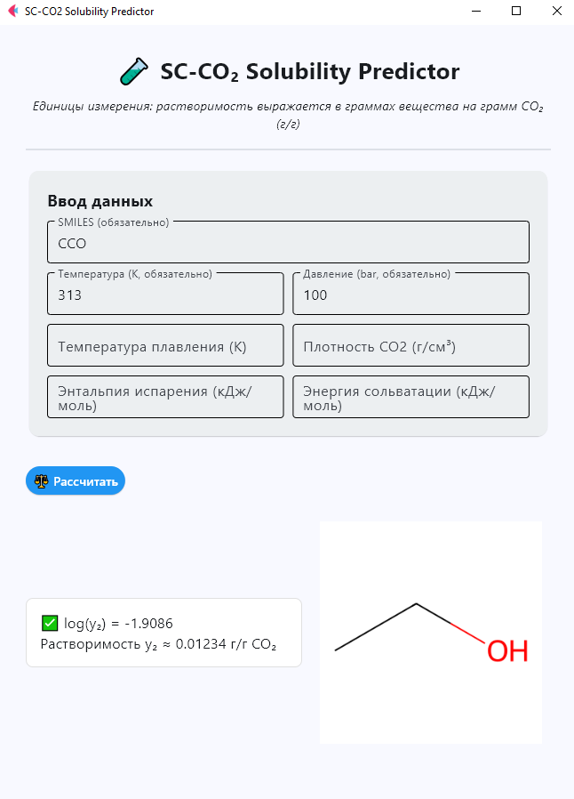

# 🧪 SC-CO₂ Solubility Predictor

Интерактивное десктоп-приложение на Python + Flet для предсказания растворимости химических соединений в сверхкритическом CO₂ по структуре (SMILES) и термодинамическим параметрам.

![Интерфейс приложения])

---

## 🚀 Возможности

- Ввод структуры вещества в формате SMILES
- Задание температуры, давления и дополнительных параметров
- Построение изображения молекулы (через RDKit)
- Предсказание log(y₂) и y₂ (в г/г CO₂)
- Графический интерфейс с валидацией и визуализацией

---

## 🛠️ Используемые технологии

- [Python 3.10+](https://www.python.org/)
- [Flet](https://flet.dev/) — фреймворк для создания GUI на Python
- [RDKit](https://www.rdkit.org/) — химическая библиотека
- [CatBoost](https://catboost.ai/) — градиентный бустинг
- `CDK_pywrapper` — генерация дескрипторов CDK из SMILES

---

## 📦 Установка

```bash
pip install flet rdkit catboost pandas CDK_pywrapper

## 🖥 Запуск

python Main.py